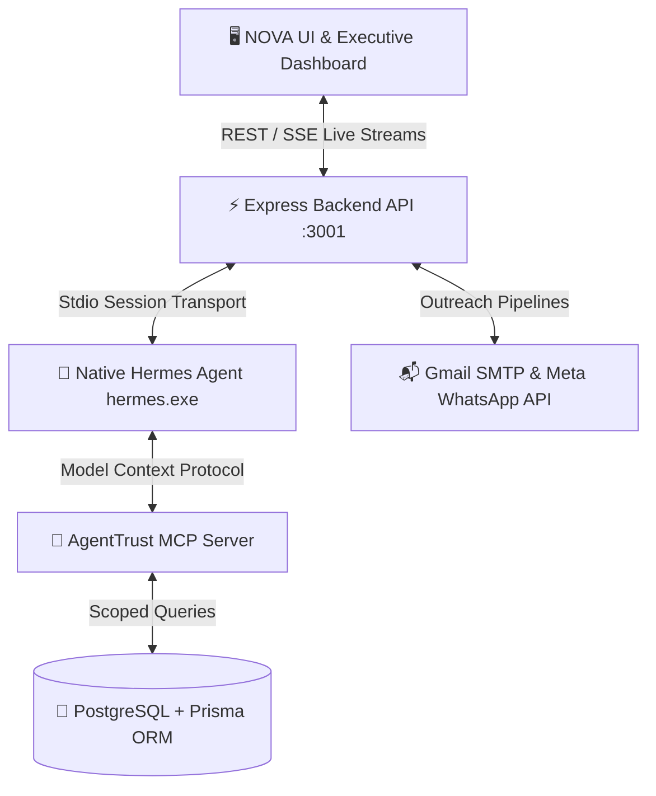

# 🌾 AgentTrust — Autonomous AI B2B Commerce & Sales Engine

[](https://www.typescriptlang.org/)
[](https://react.dev/)
[](https://tailwindcss.com/)
[](https://www.prisma.io/)
[](https://modelcontextprotocol.io/)
[](https://github.com/jiakash424/AgentTrust)

**AgentTrust** is an enterprise-grade Autonomous B2B Commerce Platform designed for manufacturers, wholesalers, and millers. Powered by a persistent **Native Hermes AI Agent** and the **Model Context Protocol (MCP)**, AgentTrust automates the full B2B sales lifecycle: from catalog price intelligence and local buyer discovery to commercial deal underwriting, personalized multi-channel outreach (Gmail & WhatsApp), and pipeline execution.

---

## 🏛️ System Architecture

AgentTrust employs a clean, single-brain autonomous execution pipeline where the frontend, backend, native AI runtime, and application database communicate via typed protocols:



### Key Architectural Pillars:
1. **Single Central AI Brain**: Driven by persistent native Hermes sessions (`hermes.exe`). The agent autonomously understands intent, reasons about business context, and invokes tools when needed.
2. **Model Context Protocol (MCP)**: Implements 10 typed MCP tools over `stdio` transport with multi-tenant workspace isolation.
3. **Real-Time Stage Progression**: Server-Sent Events (SSE) broadcast sequential research milestones (`RESEARCHING` → `VERIFYING` → `ANALYZING` → `COMPLETED`) to the NOVA Command Center.
4. **Human-in-the-Loop Governance**: High-impact actions (sending B2B quotes, cold emails, WhatsApp proposals) require explicit merchant approval.

---

## ✨ Core Feature Matrix

| Module | Route | Capabilities |
|---|---|---|
| **NOVA Command Center** | `/app` | Autonomous natural language B2B console, prompt suggestions, embedded conversation history drawer, and real-time execution steps. |
| **Executive Dashboard** | `/app/dashboard` | Real-time IST clock, APMC Mandi commodity price signals, interactive price trend SVG charts vs factory cost, scheduled activity calendar, and strategy cards. |
| **Growth Briefing** | `/app/growth` | Commercial buyer demand summaries, product revenue potential calculations, gross profit margin forecasts, and action roadmaps. |
| **B2B Opportunities** | `/app/opportunities` | AI-matched verified commercial buyers, buying price comparison, deal value estimation, and slide-over opportunity detail drawers. |
| **Lead Discovery & CRM** | `/app/leads` | Qualified buyer directory, match score rating, company profiles, direct Gmail email composer, and outreach log history. |
| **Deals Kanban Pipeline** | `/app/deals` | Visual deal flow across 6 stages (`QUALIFIED`, `OUTREACHED`, `PROPOSAL_SENT`, `NEGOTIATION`, `WON`, `LOST`) with drag/drop state updates. |
| **Product & Catalog Hub** | `/app/products` | SKU inventory management, stock levels, unit economics, factory cost tracking, and AI Buyer Readiness Scoring. |
| **Action Approvals** | `/app/approvals` | Governance center for inspecting, editing, approving, or rejecting AI-generated sales emails and WhatsApp proposals. |
| **Integrations Hub** | `/app/integrations` | 1-click connectors for Gmail (SMTP & OAuth), Meta WhatsApp Cloud API, and Mandi APMC Price feeds. |
| **Conversations** | `/app/conversations` | Dedicated multi-turn AI chat threads with full searchable history and entity context binding. |
| **Workspace Settings** | `/app/settings` | Company legal profile, GSTIN, operating scope, address, team member roles (`OWNER`, `ADMIN`, `MEMBER`), and API keys. |
| **System Diagnostics** | `/app/diagnostics` | Health monitoring for Hermes runtime, MCP server connectivity, Prisma DB connection, and provider latency. |

---

## 🔌 Model Context Protocol (MCP) Server

AgentTrust exposes its core capabilities to the Hermes agent via a dedicated Model Context Protocol server (`server/mcp/agenttrust-mcp-server.ts`).

### Implemented MCP Tools:
- `get_business_context`: Retrieves company profile, industry, operating scope, and product categories for the active workspace.
- `get_products`: Lists products in inventory with stock units, price, factory cost, and target margins.
- `get_product`: Detailed lookup for a specific product by ID or exact name.
- `get_opportunities`: Fetches matched buyer opportunities filtered by status, city, or product.
- `get_opportunity`: Deep inspection of a single buyer opportunity including commercial price signals and contact details.
- `get_leads`: Queries discovered leads with match scores and communication channels.
- `get_deals`: Returns active deals across all pipeline stages with total commercial deal value.
- `get_sales_metrics`: Aggregates total pipeline volume, average profit margin, and win rates.
- `create_opportunity`: Creates and links a new buyer opportunity directly in the database.
- `create_lead`: Adds a newly discovered B2B lead into the CRM.

> **Security Note:** Every tool strictly resolves and validates `workspaceId` to prevent cross-workspace data leakage.

---

## 🛠️ Technology Stack

- **Frontend**: React 19, TypeScript 5.7, Tailwind CSS v4 (`@tailwindcss/vite`), Framer Motion, Lucide React, Vite 8
- **Backend API**: Node.js, Express, TypeScript, Server-Sent Events (SSE)
- **Database & ORM**: PostgreSQL (Supabase), Prisma ORM 6.4
- **AI Runtime**: Native Hermes Agent (`hermes.exe`) with `@modelcontextprotocol/sdk`
- **Communication Channels**: Nodemailer (Gmail SMTP), Meta WhatsApp Cloud API

---

## 🚀 Getting Started

### 1. Prerequisites
- **Node.js**: `v20.x` or higher
- **pnpm** or **npm**
- **PostgreSQL Database** (e.g. Supabase)
- **Hermes Agent Binary** installed locally

### 2. Installation & Setup

```bash
# Clone the repository
git clone https://github.com/jiakash424/AgentTrust.git
cd AgentTrust

# Install dependencies
npm install

# Configure environment variables
cp .env.example .env
```

### 3. Environment Configuration (`.env`)

Configure your credentials in `.env`:

```env
# Database Connections (PostgreSQL / Supabase)
DATABASE_URL="postgresql://postgres:[PASSWORD]@[HOST]:6543/postgres?pgbouncer=true"
DIRECT_URL="postgresql://postgres:[PASSWORD]@[HOST]:5432/postgres"

# Supabase Auth
VITE_SUPABASE_URL="https://your-project.supabase.co"
VITE_SUPABASE_ANON_KEY="your-supabase-anon-key"

# AI Provider Credentials (Optional / Fallback)
GEMINI_API_KEY="your-gemini-api-key"
NVIDIA_API_KEY="your-nvidia-api-key"

# Communication & Outreach (Optional)
GMAIL_USER="your-email@gmail.com"
GMAIL_APP_PASSWORD="your-app-password"
```

### 4. Database Setup

```bash
# Push Prisma schema to PostgreSQL
npx prisma db push

# Generate Prisma client
npx prisma generate
```

### 5. Running the Application

In a development environment, run the backend and frontend servers:

```bash
# Terminal 1: Start Express Backend API (Port 3001)
npx tsx server/index.ts

# Terminal 2: Start Vite Frontend (Port 8443)
npm run dev
```

Open your browser at `http://localhost:8443` to access the application.

---

## 🧪 Testing & Verification

```bash
# Run TypeScript compilation check
npx tsc --noEmit

# Run Native Hermes + MCP integration test
npx tsx tests/integration/native-hermes-agent.integration.test.ts

# Build production bundle
npm run build
```

---

## 🔒 Security & Multi-Tenancy

- **Workspace Isolation**: Multi-tenant workspace filtering is enforced at the database query level on all endpoints and MCP tools.
- **Zero Secrets Tracked**: All credentials and API keys are abstracted into environment variables.
- **Human-in-the-Loop Safeguards**: Outreach drafts (Email/WhatsApp) generated by AI require explicit merchant approval prior to dispatch.

---

## 📄 License

MIT License. Developed for enterprise B2B commerce intelligence.
